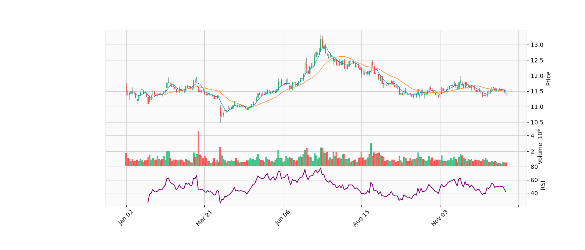
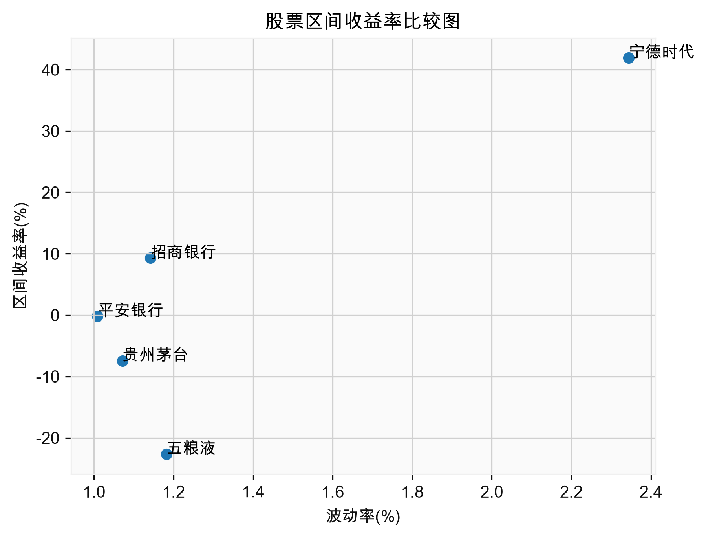
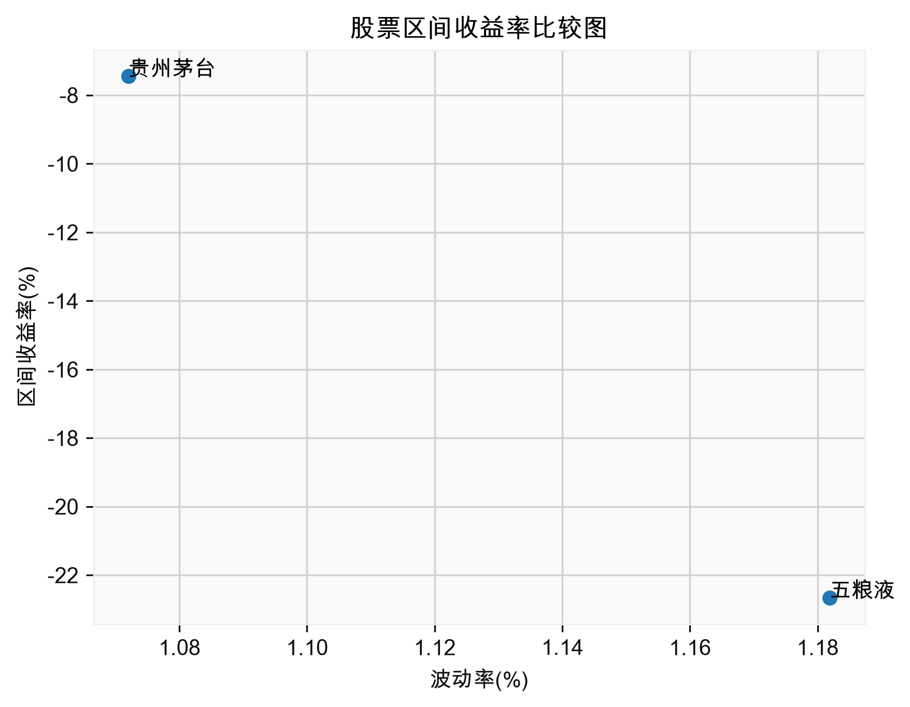

# Stock Data Analysis Database
A Python-based stock data analysis system that combines Tushare, SQLite, SQL, Pandas, and financial data visualization.
This project collects stock information and historical daily trading data through the Tushare API, stores the data in a local SQLite database, and provides several functions for querying, analyzing, comparing, and visualizing financial market data.
The project was developed as a practical learning project for Financial Engineering, with a focus on integrating Python programming, financial data analysis, SQL, databases, and quantitative analysis into a complete application.

⸻

1. Project Overview
The system provides a command-line interface for working with stock market data.
The main workflow is:
```text
Tushare API
     ↓
Data Import
     ↓
SQLite Database
     ↓
SQL Query
     ↓
Pandas Data Processing
     ↓
Financial Analysis
     ↓
Visualization
     ↓
JSON Result Export
```
The project currently supports:
* Initializing a local SQLite database
* Importing stock basic information
* Importing historical daily stock data
* Querying available stock information
* Querying historical data by stock and date range
* Single-stock analysis
* Multi-stock comparison
* Industry-level stock analysis
* Candlestick chart visualization
* Moving average analysis
* RSI analysis
* Exporting analysis results to JSON

⸻

2. Main Features
2.1 Database Initialization
The system creates the required SQLite tables and imports stock data from Tushare.
The database currently contains two main tables:
* stock_info
* stock_daily
The stock_info table stores basic stock information, while stock_daily stores historical trading data.

⸻

2.2 Stock Information Query
The system provides an overview of the stocks available in the database.
The query result includes:
* Stock code
* Stock name
* Industry
* Earliest available trading date
* Latest available trading date
Example:
| Code | Stock | Industry | Start Date | End Date |
| :--- | :--- | :--- | :--- | :--- |
| 600519 | Kweichow Moutai | Beverage | 2025-01-02 | 2025-12-31 |
| 000858 | Wuliangye | Beverage | 2025-01-02 | 2025-12-31 |
This provides a concise overview of the database without printing the entire daily dataset.

⸻

2.3 Single Stock Analysis
Users can enter:
* Stock code
* Start date
* End date
The system retrieves the corresponding historical data from SQLite and performs quantitative analysis.
The analysis may include:
* Price statistics
* Interval return
* Daily return
* Volatility
* Maximum daily increase
* Maximum daily decline
* Maximum drawdown
* Moving averages
* RSI
A candlestick chart can also be generated for visual analysis.

⸻

2.4 Multi-Stock Comparison
Users can enter multiple stock codes and compare their historical performance.
The system calculates indicators such as:
* Interval return
* Volatility
* Maximum increase
* Maximum decline
* Maximum drawdown
The stocks can then be compared according to these quantitative indicators.
This feature provides a simple framework for analyzing the differences between several securities over the same period.

⸻

2.5 Industry Analysis
Users can select an industry and retrieve the stocks belonging to that industry.
The system then performs analysis on the selected group of stocks.
This demonstrates how SQL filtering, relational database queries, and financial data analysis can be combined to analyze stocks at an industry level.

⸻

2.6 Financial Data Visualization
The project uses financial charts to visualize stock price movements.
Current visualization features include:
* Candlestick charts
* Trading volume
* Moving averages
* RSI
* Multi-stock comparison charts
The project uses:
* mplfinance for financial charts
* Matplotlib for general data visualization

⸻

2.7 Result Export
The system saves analysis results to JSON files.
Examples include:
single_analysis_result.json
compare_result.json
industry_result.json
This separates the analysis process from the final result storage and makes the output easier to reuse.

⸻

3. System Architecture
The project uses a modular structure to separate different responsibilities.
```text
                    Tushare API
                        │
                        ▼
                ┌────────────────┐
                │ import_data.py  │
                └───────┬────────┘
                        │
                        ▼
                ┌────────────────┐
                │    SQLite DB    │
                │   stock.db      │
                └───────┬────────┘
                        │
                        ▼
                ┌────────────────┐
                │ query_data.py   │
                └───────┬────────┘
                        │
          ┌─────────────┼─────────────┐
          ▼             ▼             ▼
   Single Analysis   Comparison   Industry Analysis
          │             │             │
          └─────────────┼─────────────┘
                        ▼
                ┌────────────────┐
                │     draw.py     │
                └───────┬────────┘
                        │
                        ▼
                ┌────────────────┐
                │  save_data.py   │
                └────────────────┘
```
⸻

4. Project Structure
```text
stock-data-analysis-database/
│
├── main.py
│
├── database.py
├── import_data.py
├── query_data.py
│
├── compare.py
├── single_analysis.py
├── industry_analysis.py
│
├── draw.py
├── save_data.py
│
├── stock.db
│
├── images
│   stock_comparison.png
│   kline.png 
│   industry_comparison.png
│
├── README.md
├── requirements.txt
└── .gitignore
```
## File Description
| File | Description |
| :--- | :--- |
| `main.py` | Main program and command-line interface |
| `database.py` | Database connection and table creation |
| `import_data.py` | Retrieves and imports data from Tushare |
| `query_data.py` | SQL queries and data retrieval |
| `compare.py` | Multi-stock quantitative comparison |
| `single_analysis.py` | Single-stock quantitative analysis |
| `industry_analysis.py` | Industry-level analysis |
| `draw.py` | Financial data visualization |
| `save_data.py` | Saves analysis results |
| `stock.db` | Local SQLite database |

⸻

5. Database Design
The project uses SQLite as the local relational database.
5.1 
stock_info
This table stores basic stock information.
Typical fields include:
code
stock
industry
Example:
| Code | Stock | Industry |
| :--- | :--- | :--- |
| 600519 | Kweichow Moutai | Beverage |
| 000858 | Wuliangye | Beverage |

⸻

5.2 
stock_daily
This table stores historical daily trading data.
Typical fields include:
code
date
open
high
low
close
pre_close
change
pct_change
volume
amount
The two tables are connected using the stock code:
```text
stock_info.code
       │
       │
       ▼
stock_daily.code
```
SQL JOIN operations are used to combine basic stock information with historical market data.

⸻

6. Technologies
Programming
* Python
Financial Data
* Tushare
Data Processing
* Pandas
* NumPy
Database
* SQLite
* SQL
Visualization
* Matplotlib
* mplfinance
Data Formats
* JSON
* CSV

⸻

7. Main Program
The program provides the following command-line menu:
====================
Stock Data Analysis Database
====================

1. Initialize Database
2. Query Stock Information
3. Analyze a Single Stock
4. Compare Multiple Stocks
5. Industry Stock Analysis
6. Exit

⸻

7.1 Initialize Database
The initialization process:
1. Creates the database tables
2. Imports stock basic information
3. Imports historical daily trading data

⸻

7.2 Query Stock Information
The system displays the stocks currently available in the database together with their industry and historical data range.
This allows users to understand what data is available before performing further analysis.

⸻

7.3 Analyze a Single Stock
The user enters:
Stock code
Start date
End date
The system then:
1. Queries the database
2. Retrieves historical data
3. Performs quantitative analysis
4. Generates a candlestick chart
5. Calculates technical indicators
6. Saves the results as JSON

⸻

7.4 Compare Multiple Stocks
The user enters multiple stock codes.
The system then:
1. Queries historical data
2. Calculates quantitative indicators
3. Compares the selected stocks
4. Generates visualization
5. Saves the results

⸻

7.5 Industry Stock Analysis
The user enters an industry name.
The system then:
1. Queries all matching stocks
2. Retrieves their historical data
3. Performs group-level analysis
4. Generates visualization
5. Saves the results

⸻

8. Quantitative Analysis
The project currently focuses on several basic quantitative indicators.
8.1 Interval Return
Interval return measures the price performance during a selected period.
Return = (Ending Price - Beginning Price) / Beginning Price

⸻

8.2 Volatility
Volatility is calculated from the variation of daily returns.
Volatility = Standard Deviation of Daily Returns
A higher value indicates larger fluctuations in daily returns during the selected period.

⸻

8.3 Maximum Drawdown
Maximum drawdown measures the largest decline from a historical peak to a subsequent trough.
Drawdown = (Current Value - Historical Peak) / Historical Peak
The minimum value of the drawdown series represents the maximum drawdown.

⸻

8.4 Moving Average
Moving averages are used to smooth short-term price fluctuations and observe price trends.
The project currently uses moving averages in financial charts.

⸻

8.5 RSI
The Relative Strength Index (RSI) is used as a technical indicator to measure the magnitude of recent price movements.
The project implements RSI using historical daily price data.

⸻

9. Example Workflow
Suppose the user wants to compare several stocks over a specific period.
Input:
Stock codes:
600519, 000858, 601318

Start date:
20250101

End date:
20251231
The system retrieves the corresponding data from SQLite and calculates quantitative indicators.
The results can be used to compare:
* Historical returns
* Volatility
* Maximum drawdown
* Maximum daily increase
* Maximum daily decline
The system can also generate financial charts for further visual inspection.

⸻

10. Data Source
The financial data used in this project is obtained from the Tushare financial data interface.
The project is intended for:
* Educational purposes
* Financial programming practice
* Data analysis practice
* Quantitative analysis learning
The results should not be interpreted as investment advice.

⸻

11. Installation
Clone the repository:
git clone <your-repository-url>
cd stock-data-analysis-database
Install the required Python packages:
pip install pandas numpy matplotlib mplfinance tushare
SQLite is included in the Python standard library and normally does not require a separate installation.

⸻

12. Tushare Configuration
A Tushare account and API token are required to retrieve financial data.
The API token should never be committed to GitHub.
A recommended approach is to store the token in an environment variable or a .env file.
For example:
TUSHARE_TOKEN=your_token_here
Then:
import os
import tushare as ts

token = os.getenv("TUSHARE_TOKEN")

ts.set_token(token)

pro = ts.pro_api()
Sensitive files should be included in .gitignore:
.env
__pycache__/
*.pyc
If the local database is large or contains generated data, it can also be excluded:
*.db

⸻

13. Error Handling
The current version includes basic handling for cases such as:
* Invalid menu selections
* Empty query results
* No matching stock data
* Invalid date ranges
* Missing data for the requested period
For example, when a query returns no data:
No matching data was found.
More advanced input validation and error handling can be added in future versions.

⸻

14. Limitations
This project is primarily a personal learning and portfolio project.
Current limitations include:
* Limited historical data coverage
* Command-line interface only
* Basic input validation
* No real-time market data
* No automated data update scheduler
* Limited technical indicators
* No backtesting engine
* SQLite is intended for local data analysis rather than large-scale multi-user applications
* No user authentication or web interface
These limitations provide possible directions for future development.

⸻

15. Future Improvements
Possible future improvements include:
Data Layer
* Automatic daily data updates
* Incremental data import
* Duplicate data detection
* Database indexing
* More financial datasets
Quantitative Analysis
* MACD
* Bollinger Bands
* Sharpe Ratio
* Beta
* Correlation analysis
* Portfolio analysis
* Factor analysis
* Basic backtesting
Visualization
* Interactive charts
* Interactive dashboards
* Performance comparison dashboards
* Industry heatmaps
* Web-based visualization
Application
* Web interface
* REST API
* Interactive stock search
* Portfolio management
* User-defined analysis parameters

⸻

16. Learning Objectives
This project was developed to practice the integration of several technologies into a complete financial data application.
The main learning objectives are:
* Using APIs to obtain financial data
* Designing relational database tables
* Writing SQL queries
* Understanding SQL JOIN
* Using Pandas for financial data processing
* Performing quantitative analysis
* Creating financial visualizations
* Designing modular Python programs
* Separating data acquisition, database operations, analysis, visualization, and result storage
* Building a complete financial data workflow

⸻

17. Project Development Progression
This project is part of a series of financial programming projects.
The overall progression is:
```text
Python Fundamentals
        ↓
Stock Management System
        ↓
CSV-Based Stock Analysis
        ↓
Tushare-Based Quantitative Analysis
        ↓
SQLite Stock Analysis Database
        ↓
Future Financial Data Application
```
Each project focuses on a different layer of development rather than simply repeating the same implementation with different technologies.

⸻

18. Disclaimer
This project is for educational and research purposes only.
The financial data and analysis provided by this project should not be considered investment advice or a recommendation to buy or sell any security.
Financial markets involve significant risks. Users should conduct their own research and make independent decisions.

⸻

19. Author
A personal learning project focused on:
* Financial Engineering
* Python
* Financial Data Analysis
* Quantitative Analysis
* SQL
* Database Applications
* Financial Technology

⸻